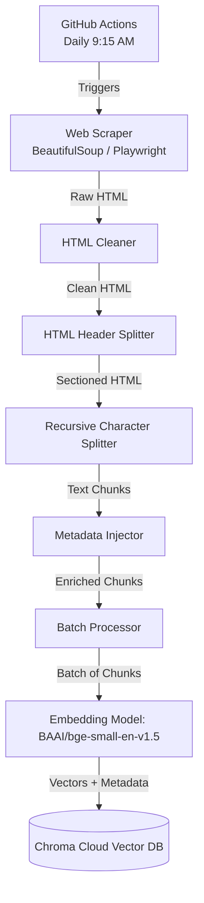

# Data Ingestion Architecture: Scraping, Chunking, and Embedding

This document outlines the dedicated architecture for the daily data ingestion pipeline. It details how data from the specified Groww URLs is scraped, divided into semantic chunks, converted into vector embeddings, and stored for retrieval.

---

## 1. Pipeline Overview

---

## 2. Scraping Strategy
Since the source documents are HTML pages from Groww (no PDFs), the extraction relies entirely on web scraping.

*   **Trigger Mechanism:** A GitHub Actions workflow is scheduled via a cron expression (`15 9 * * *`) to automatically run the scraping script every day at 9:15 AM.
*   **Tooling:** Python libraries such as `requests` and `BeautifulSoup` (or `Playwright` if the pages rely heavily on client-side rendering).
*   **HTML Cleaning:** 
    *   Strip out all `<nav>`, `<footer>`, `<header>`, `<script>`, and `<style>` tags to remove boilerplate and noise.
    *   Extract only the core `<main>` content area where the fund's details, tables (expense ratio, exit load), and text are located.

---

## 3. Chunking Strategy
Because mutual fund data is highly structured (containing headings, paragraphs, and tables), a generic character splitter is insufficient. The chunking process occurs in two phases:

### Phase 1: HTML-Aware Splitting
*   **Concept:** Use a tool like LangChain's `HTMLHeaderTextSplitter`.
*   **How it works:** The splitter breaks the HTML document based on structural tags (`<h1>`, `<h2>`, `<h3>`). 
*   **Benefit:** This ensures that logically related text (e.g., all information under the "Exit Load" heading) stays grouped together. The heading names are automatically added to the metadata of the resulting chunks.

### Phase 2: Content Splitting (Tables & Text)
*   **Concept:** Apply a `RecursiveCharacterTextSplitter` on the sections generated from Phase 1.
*   **Configuration:**
    *   **Chunk Size:** ~500 to 1000 tokens.
    *   **Chunk Overlap:** ~100 tokens (to maintain context across split boundaries).
*   **Handling Tables:** 
    *   HTML tables contain critical facts like expense ratios and minimum SIP amounts. 
    *   The splitter must be configured to *not* break HTML `<table>` tags across chunks. If a table exceeds the chunk size, it is either converted to Markdown format before splitting or kept intact as a single chunk to ensure the LLM can interpret the rows and columns accurately.

---

## 4. Metadata Enrichment
Before embedding, each chunk is enriched with mandatory metadata to satisfy the architectural constraints.

*   **`Source_URL`**: The exact URL from the 5 specified HDFC scheme links.
*   **`Fund_Name`**: Extracted dynamically from the URL or the `<h1>` tag (e.g., "HDFC Mid-Cap Opportunities Fund").
*   **`Section_Heading`**: Inherited from Phase 1 of chunking (e.g., "Expense Ratio").
*   **`Last_Updated_Date`**: The timestamp of when the GitHub Action was executed, ensuring the required footer ("Last updated from sources: <date>") can be generated accurately.

---

## 5. Embedding & Storage

### 5.1 Embedding Model
*   **Model Selection:** The open-source `BAAI/bge-small-en-v1.5` dense embedding model, chosen for its strong retrieval performance and cost-efficiency compared to OpenAI alternatives.
*   **Batching:** To optimize processing and local memory, chunks are sent to the embedding model in batches (e.g., 100 chunks per request).

### 5.2 Vector Database Operations
*   **Database Selection:** Chroma Cloud (trychroma.com). The system connects via `chromadb.HttpClient` using securely injected environment variables (`CHROMA_CLOUD_HOST`, `CHROMA_TENANT`, `CHROMA_API_KEY`). There is no local vector database footprint.
*   **Upsert Logic:** 
    *   Since the GitHub Action runs daily, the pipeline must avoid duplicating data. 
    *   Before inserting new chunks, the system deletes all existing vectors associated with the `Source_URL` being processed, and then upserts the fresh vectors. This guarantees the database strictly mirrors the latest live data.
