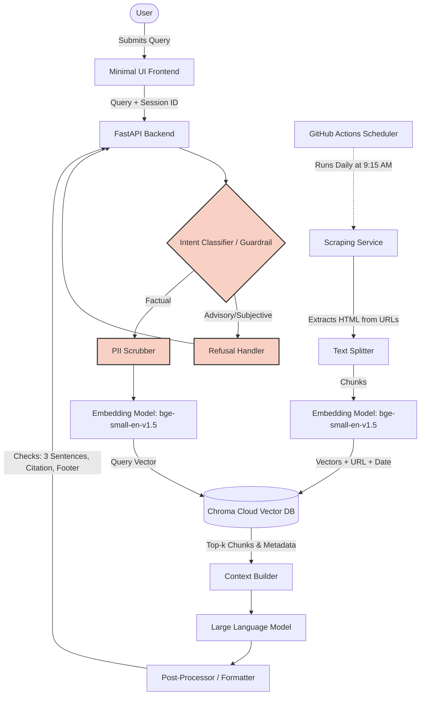

# RAG Architecture: Mutual Fund FAQ Assistant

## 1. System Overview

The Mutual Fund FAQ Assistant is a lightweight Retrieval-Augmented Generation (RAG) system designed to provide factual, objective answers about mutual fund schemes based exclusively on a curated set of official documents (AMC, AMFI, SEBI). The architecture strictly enforces compliance, facts-only answering, and robust refusal mechanisms for advisory questions.

---

## 2. High-Level Architecture Diagram

---

## 3. Core Components

### 3.1 Data Ingestion Pipeline
This pipeline processes the following curated list of official URLs for HDFC Mutual Fund schemes:
1. https://groww.in/mutual-funds/hdfc-mid-cap-fund-direct-growth
2. https://groww.in/mutual-funds/hdfc-equity-fund-direct-growth
3. https://groww.in/mutual-funds/hdfc-focused-fund-direct-growth
4. https://groww.in/mutual-funds/hdfc-elss-tax-saver-fund-direct-plan-growth
5. https://groww.in/mutual-funds/hdfc-large-cap-fund-direct-growth

*   **Scheduler:** GitHub Actions configured with a cron trigger to run the pipeline automatically **every day at 9:15 AM** to fetch the latest market data and factsheet updates.
*   **Scraping Service:** A dedicated service that navigates to the specified URLs to extract the HTML content. (Currently, no PDFs will be provided, so only HTML content is scraped).
*   **Chunking Strategy:** Semantic or recursive character splitting ensuring chunks retain full context (e.g., maintaining table structures for expense ratios and exit loads).
*   **Metadata Extraction:** Every chunk is strictly tagged with its `Source_URL` and `Last_Updated_Date`.
*   **Vector Database:** Chroma Cloud (trychroma.com) accessed via secure HTTP client, ensuring a serverless database footprint without local storage overhead.

### 3.2 Query Processing & Guardrails
Ensures safety, compliance, and intent filtering before hitting the RAG pipeline.
*   **PII Scrubber:** Uses regex or NER to detect and reject/mask queries containing PAN, Aadhaar, account numbers, emails, or phone numbers.
*   **Intent Classifier / Router:** A lightweight LLM call or fine-tuned classifier that categorizes the user query.
    *   *Advisory/Opinion:* "Which fund is better?" -> Routes to Refusal Handler.
    *   *Factual:* "What is the exit load?" -> Routes to Retrieval.
*   **Refusal Handler:** Generates a polite, standardized refusal template emphasizing the "facts-only" constraint and attaching an AMFI/SEBI educational link.

### 3.3 Retrieval & Generation (RAG Core)
*   **Retriever:** Performs semantic similarity search on the Chroma Cloud Vector DB to fetch the most relevant chunks.
*   **Prompt Constructor:** Injects the retrieved chunks, user query, and strict system instructions into the LLM prompt. The instructions will mandate:
    1.  Maximum of 3 sentences.
    2.  No financial advice.
    3.  Output formatting to easily parse the source link and date.
*   **LLM:** Groq (using `llama-3.3-70b-versatile`) generates the raw response based *only* on the provided context. Groq is chosen for its extremely fast inference speed.

### 3.4 Post-Processor & Formatter
Enforces the strict output constraints before sending the response to the user.
*   **Sentence Truncation/Validation:** Ensures the response does not exceed 3 sentences.
*   **Citation Injection:** Extracts the `Source_URL` from the retrieved metadata and appends it as exactly one citation link.
*   **Footer Appender:** Appends the mandatory string: `“Last updated from sources: <date>”` using the metadata `Last_Updated_Date`.

### 3.5 Application Layer (Implemented)
*   **Backend API:** Built with FastAPI to handle RAG pipeline execution, session management via unique thread IDs, and serving static frontend files.
*   **User Interface:** A premium HTML/CSS/JS frontend featuring:
    *   **Groww-inspired Design:** Clean minimalist aesthetics with the signature green palette.
    *   **Guardrail Awareness:** Prominent "Facts-only" disclaimer and pre-baked example queries for safe navigation.
    *   **Dynamic Chat:** Real-time message streaming (simulated) and automatic citation/footer formatting.

---

## 4. Constraint Enforcement Checklist

| Requirement | Implementation Mechanism | Status |
| :--- | :--- | :--- |
| **Only Official Sources** | Whitelist HDFC URLs in scraper. Block 3rd-party content. | ✅ Done |
| **No PII Collection** | `scrub_pii()` function redacts PAN, Aadhaar, Phone in `rag_pipeline.py`. | ✅ Done |
| **Refuse Advice** | `is_advisory_query()` Intent Classifier diverts subjective queries. | ✅ Done |
| **Max 3 Sentences** | LLM System Prompt + Python-based sentence truncation in post-processor. | ✅ Done |
| **Exactly 1 Citation** | Metadata extraction in `rag_pipeline.py` selects top chunk URL. | ✅ Done |
| **Footer String** | Hardcoded date string using `Last_Updated_Date` metadata. | ✅ Done |
| **Premium UI** | Custom CSS with Outfit typography and Groww branding. | ✅ Done |
| **Cloud Database** | Integrated with Chroma Cloud via `CloudClient`. | ✅ Done |
